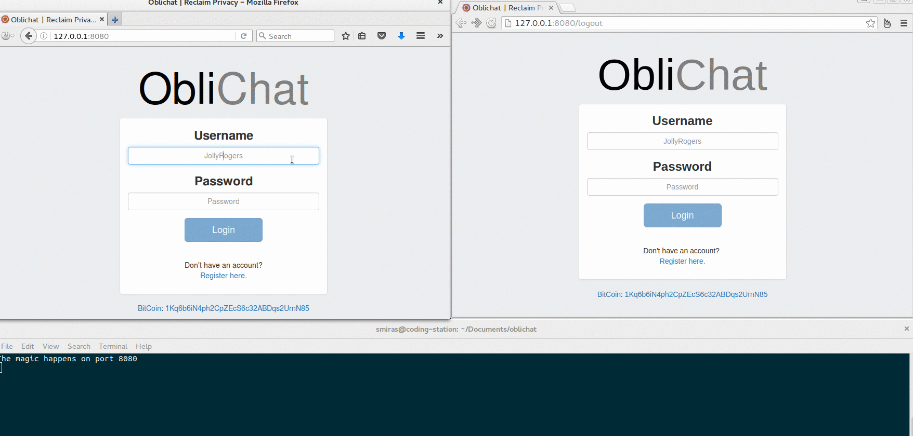

## 

# Oblichat

**Oblichat** is a web-based chat application which is really *oblivious*. In other words the web server forgets every message that is being sent (no message is ever recorded) and the browser forgets the messages everytime the user logs out.

I have implemented **end-to-end encryption** using RSA keys that are generated every time the user logs in but what is most notable about this web application is that no one from the server side can ever decrypt the messages. The private key stays in the user's browser and it is never sent to the server.

The encryption and the decryption of the messages happens **on the fly** and it's completely transparent to the end user as you can see in the example below (check the console window to see how the messages look like when they pass through the server).

**Oblichat** was made using `Node.js` + `sockets.io` + `pjax`. It is a single-page web application and each page is loaded dynamically using AJAX. Right now it is only a very basic prototype to present you the general idea.

## Installation
Navigate to oblichat folder after the download and run `npm install`

If you encounter problems during the installation of the module `mmmagic` I suggest you to uninstall nodejs and install the latest version using this [gist](https://gist.github.com/isaacs/579814).

**Important**  
Don't forget to change the value of the `SECRET_TOKEN` that is located in `server.js`

## Usage
Open your browser and navigate to `http://localhost:8080`

### License

`Oblichat` is released under the MIT license.

### Dependencies

- Node.js
- Socket.io
- MongoDB
- pjax
